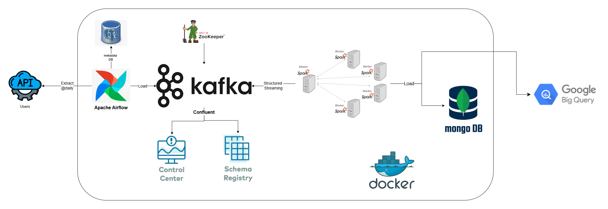

# 🚀 Realtime Data Streaming Project

## 📘 Introduction

This is a hands-on project that builds an end-to-end **data engineering pipeline**. It covers every stage — from **data ingestion** to **processing** and **storage**, using a powerful tech stack:

- Apache Airflow  
- Python  
- Apache Kafka  
- Apache Zookeeper  
- Apache Spark  
- MongoDB  

All components are containerized using **Docker**.

---

## 🏗️ System Architecture




---

## 🛠️ Technologies Used

- **Apache Airflow**
- **Python**
- **Apache Kafka**
- **Apache Zookeeper**
- **Apache Spark**
- **MongoDB**
- **PostgreSQL**
- **Docker**

---

## 🔄 Pipeline Flow

1. **Data Source**  
    Uses `randomuser.me` API to generate random user data.

2. **Apache Airflow**  
   Orchestrates the pipeline and sends fetched data to Kafka.

3. **Apache Kafka & Zookeeper**  
   Stream data from Airflow to Apache Spark.

4. **Control Center & Schema Registry**  
   Monitor Kafka and manage schemas.

5. **Apache Spark**  
   Processes data from Kafka using Structured Streaming and writes it to MongoDB.

6. **MongoDB**  
   Stores processed data for querying and analysis.

---

## 🚀 Steps to Start

### 1. Clone the Repository

```bash
git clone https://github.com/Youssefalaa99/Data-Engineering-Project.git
```

### 2. Activate Virtual Environment
```bash
python -m venv venv
source venv/bin/activate
```

### 3. Install Required Packages
```bash
pip install -r requirements.txt
```

### 4. Run Docker Services
```bash
docker-compose up -d
```

### 5. Start Airflow DAG
- Go to Airflow Web UI, login, and unpause **stream_to_kafka** DAG.

---

## 🌐 Interface Links
### Airflow UI
- **URL**: http://localhost:8080
  - Username: `admin`
  - Password: `admin`

### Kafka Confluent Control Center
- **URL**: http://localhost:9021

### Spark Master UI
- **URL**: http://192.168.71.128:9090/

---

## ▶️ Running Spark Streaming
### Method 1: Direct Python Run
```bash
python spark/src/main.py
```
### Method 2: Spark Submit
```bash
spark-submit --master spark://localhost:7077 \
    --packages org.apache.spark:spark-sql-kafka-0-10_2.12:3.1.1,org.mongodb.spark:mongo-spark-connector_2.12:10.5.0 \
    spark/src/main.py
```

## 📎 Reference

Special thanks to **CodewithYu** for the project inspiration.  
🎥 [Original Project Video](https://www.youtube.com/watch?v=GqAcTrqKcrY&t=1s)